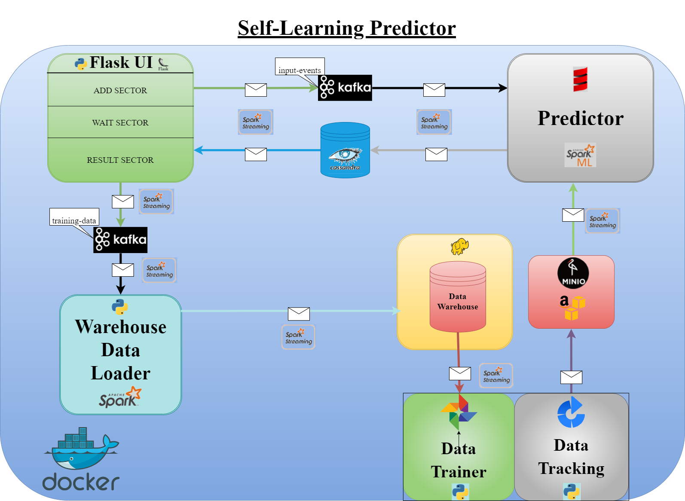

# Self-Learning Predictor

### _*Бизнес-задача:*_

Создание самообучающейся системы предиктивной аналитики для прогнозирования смерти от COVID-19, на основе данных о поступившем пациенте, для определения степени надзора за ним.

### Ссылки на UI сервисов:
+ Self_Learning_Predictor  - http://127.0.0.1:5000/
+ Minio (minio/miniominio) - http://127.0.0.1:9501/
+ MlFlow - http://127.0.0.1:5500/  
+ AirFlow (admin/admin)- http://127.0.0.1:8080/

### Запуск системы
Для старта необходимо запустить скрипт start_self_learning_predictor.bat. 
Он скачает и соберёт все необходимые образы и поднимет 13 необходимых контейнеров, после чего система будет готова к использованию.